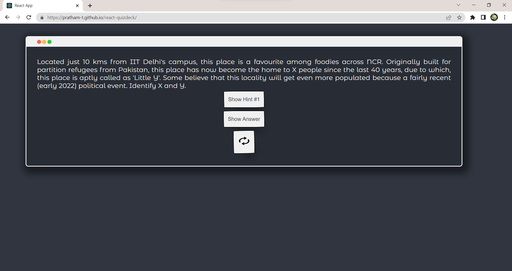

# Quizdeck: Decks with question and answer

A small React app made to learn React basics. Quizdeck is what it's name says: a card showing a question and answer and hints(if available) hidden. Think if you know the answer, then reveal it to see if you are correct or not!

Check it out on [react-quizdeck Github Pages](https://pratham-t.github.io/react-quizdeck/)

## Walkthrough
- A deck contains a question and some buttons.
- "Show Answer" button will reveal the answer (cautious if you want to take a guess!)
- If hints are available for a question, "Show Hint #x" button will be visible. Pressing it will reveal one hint at a time.
- "Reload" button will change the question.

## TODO
1. Finding a way to parse newline (\n) in strings to linebreaks in HTML. Or any other way to give linebreaks in questions. Some are very long!
2. Image questions!
3. Title hints, bold and italic hints in questions.
4. Perfect centering of the card.

(Looks like if I continue the work, it's still quite some stretching on my React skills. Anyway, everything is a learning opportunity and there's still a long way to go... To quote a great saint, "Much to learn, you still have.")

